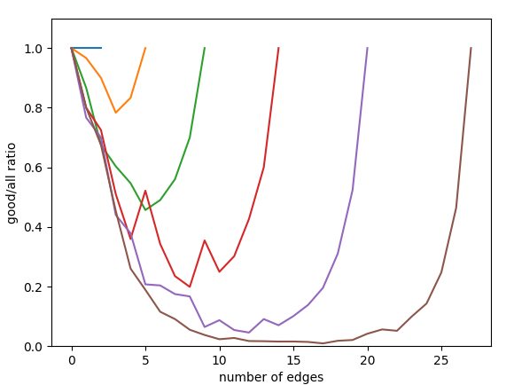

# Grounded-L graphs

## bruteforce

For each vertex ordering we consider every combination of the heights of L-shapes. 
Then for given ordering and heights for each L we try to find the appropriate length for it to intersect with required Ls. That we can do in $O(n)$.

## bruteforce smarter

For each vertex ordering we try to construct an L-graph representation with the same method as described in the paper.

That is, for each vertex we find the minimal height required for it's vertical line to intersect with every smaller vertex (in current ordering) and minimal lenght of it's horizontal line such as it reaches every greater vertex.
If during this process two lines that should not intersect do intersect, there is no representation which induces given ordering.

## pattern elimination
We find the leftmost *forbidden pattern* in a permutation and discard every other permutation with the same prefix, as we know that such permutation would contain the same forbidden pattern.

With this method we check only a fraction of all the possible permutations (around $10\%$ for 11-vertices graph; the bigger the graph, the smaller the ratio)

Faster than bruteforce for graphs with more than 10 vertices

## stats

We can observe the amount of *good* and *bad* orderings.

Here is a graph of `good_oderings/all_orderings` for random graphs (with given number of nodes and edges) with up to 8 nodes, with 10 graphs for each number and edges count combination:

